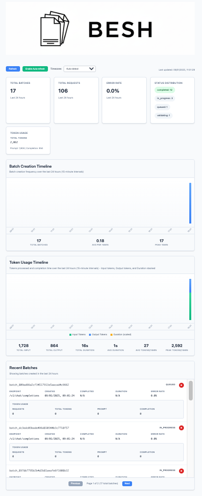
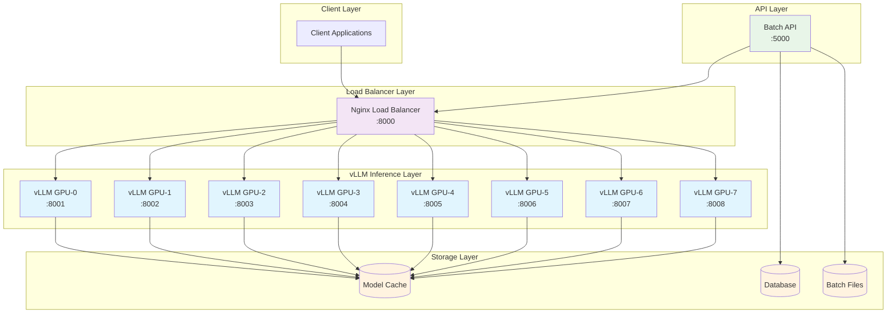

# BESH


A high-performance batch processing API for large language models with support for both single-GPU and multi-GPU (8-GPU) deployments.

## Features

🚀 Intelligent Queue Management  
⚡ Advanced Parallel Processing  
🔄 Production-Ready Reliability  
📊 Real-Time Analytics Dashboard  
🎯 Enterprise-Scale Architecture  
💾 Persistent Storage  

## Quick Start

### Standard Deployment (Single GPU)

```bash
# Single GPU setup with validation and health checks
make quick-start

# Access the dashboard
curl http://localhost:5000/
```

### High-Performance Deployment (8-GPU)

For high-throughput production workloads, use the 8-GPU configuration with load balancing:

```bash
# 8 GPU setup with validation and health checks  
make quick-start-8gpu
```

## Screenshots



Features:

- See throughput per 15min
- See uploads per 15min
- See stats per 24h
- See and delete individual batches

## Full control

```bash
# Single GPU operations
make up          # Start services
make down        # Stop services  
make rebuild     # Full rebuild
make logs        # View logs
make health      # Check service health

# 8 GPU operations
make up-8gpu     # Start 8 GPU setup
make down-8gpu   # Stop 8 GPU setup
make rebuild-8gpu # Full 8 GPU rebuild
make health-8gpu # Check 8 GPU health
```

## Tips

Things you might want check:

- `MAX_WORKERS=128` & `MAX_CONCURRENT_BATCHES=10` in the docker compose files of the batch api.
  - if the batches are very large, maybe from concurrent batches, or visa versa.
  - Find your most efficient number of workers, I found 128 for H100 running a small model.
- `events {worker_connections 2048;}` Make sure this value is larger then MAX_WORKERS.
- Consider uploading the model once for faster init on 8 gpus.
- There is no storage managment system -> make sure you delete your batch files (in & out)

Helpers:

```bash
make help        # Show all available commands
make status      # Show service status
make validate-env # Validate environment variables
```

## 8-GPU Architecture Overview

The 8-GPU deployment provides horizontal scaling with the following architecture:



## Options

### Test Model Inference

```bash
# Test vLLM endpoint directly
curl http://localhost:8000/v1/completions \
    -H "Content-Type: application/json" \
    -d '{
        "model": "<your_model_name>",           
        "prompt": "Why is open source important for the progress of AI?",
        "max_tokens": 100,
        "temperature": 0.3
    }'

# Test batch API health
curl http://localhost:5000/health
```

### Pytest

Run individual endpoint tests + 100 calls to openai gpt-nano. We do not have a pytest for GPUs. We advise running the `test_large.py` and `test_api.py` manually to check GPU deployment. Since vLLM is openai compatible, we did not see the need for those test.

```bash
# Make sure to have TEST_API_KEY=<openai_api_key> if you want to use a different key for testing
make test
```

### Helper files

- [`scripts/check_batch.py`](scripts/check_batch.py) – CLI check batch from ID
- [`scripts/delete_x.py`](scripts/delete_x.py) – CLI delete files and/or Bacthes

### CI/CD

Recommended to only update the batch-api using this command for CI/CD pipelines.

```bash
docker compose up -d --no-deps --build batch-api
```

## Contribute

Contributions are welcome! Feel free to open an issue or submit a pull request.


## Contact

- **Author:** Floris Fok
- **📧 Email:** [floris.fok@prosus.com](mailto:floris.fok@prosus.com)
- **🔗 LinkedIn:** [floris-jan-fok](https://www.linkedin.com/in/floris-jan-fok/)